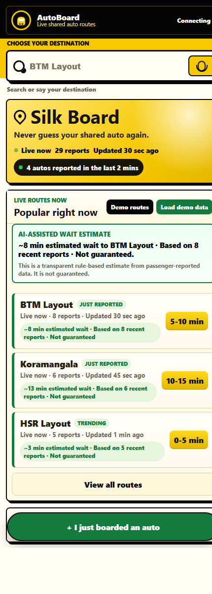

# AutoBoard

**A QR-powered live route board for Bengaluru shared auto stands.**

AutoBoard helps passengers at busy shared autorickshaw stands know which routes are active right now. A passenger scans a QR board at the stand, sees the live route board, and can update the board after boarding in two taps. No login. No driver app. No change to existing auto-stand culture.

## Live Demo

Main app:

https://autoboard-8e77c.web.app

Best judge demo:

https://autoboard-8e77c.web.app/stand/silkboard

Printable QR board example:

https://autoboard-8e77c.web.app/board.html?stand=silkboard

## Demo Screenshot



## Problem

At shared auto stands, passengers usually do not know whether an auto is currently taking their route. Drivers may shout destinations, passengers may wait uncertainly, and newcomers to the city struggle even more.

The decision window is very short. A passenger standing at a junction needs to know:

- Which routes are active now?
- How recently was this route reported?
- Roughly how long are people waiting?

## Solution

AutoBoard turns each auto stand into a live passenger-powered route board.

1. A QR poster is placed at a stand.
2. Passenger scans it.
3. The correct stand page opens automatically.
4. Passenger sees live routes from recent reports.
5. If they just boarded, they update the board in two taps.

## Final Pilot Stands

- Majestic
- Shivajinagar Bus Stand
- KR Market
- Silk Board
- Hebbal

## Passenger Links

- Majestic: https://autoboard-8e77c.web.app/stand/majestic
- Shivajinagar: https://autoboard-8e77c.web.app/stand/shivajinagar
- KR Market: https://autoboard-8e77c.web.app/stand/krmarket
- Silk Board: https://autoboard-8e77c.web.app/stand/silkboard
- Hebbal: https://autoboard-8e77c.web.app/stand/hebbal

## QR Board Links

These pages generate printable QR boards for each stand:

- Majestic: https://autoboard-8e77c.web.app/board.html?stand=majestic
- Shivajinagar: https://autoboard-8e77c.web.app/board.html?stand=shivajinagar
- KR Market: https://autoboard-8e77c.web.app/board.html?stand=krmarket
- Silk Board: https://autoboard-8e77c.web.app/board.html?stand=silkboard
- Hebbal: https://autoboard-8e77c.web.app/board.html?stand=hebbal

## Key Features

- Stand-specific QR links using `/stand/{standId}`
- Live route board from Firebase Realtime Database
- Shows only recent route activity from the last 30 minutes
- Two-tap passenger reporting flow
- Destination search and voice input for route reporting
- AI-assisted wait estimate with a transparency note
- Ranked route suggestions based on recent stand activity
- Judge-friendly "Load demo data" button
- Seeded Bengaluru routes for pilot stands
- Demo fallback state when there is no live data yet
- Printable QR poster page for each stand
- Firebase Hosting rewrite support for `/stand/**`

## How The Demo Works

1. Open a QR board page, for example:

   https://autoboard-8e77c.web.app/board.html?stand=silkboard

2. Scan the QR code or open the passenger page:

   https://autoboard-8e77c.web.app/stand/silkboard

3. View the live route board.

4. Search or tap a destination.

5. Tap a wait time.

6. Watch the board update in real time.

## Tech Stack

- HTML
- CSS
- JavaScript
- Firebase Hosting
- Firebase Realtime Database

## Firebase Data Model

Passenger reports are stored at:

```text
stands/{standId}/requests/{requestId}
```

## AI Transparency

AutoBoard uses a small transparent inference layer. It does not use hidden personal data and it does not guarantee that an auto will arrive.

What the system infers:

- Approximate wait time for active routes
- Suggested route order while searching
- Which routes appear active or trending

What data it uses:

- Passenger-submitted route reports
- Passenger-submitted wait time ranges
- Report timestamps from the last 30 minutes
- Current stand ID from the QR link

How it works:

- Wait estimates are calculated from recent passenger wait-time reports using a simple weighted average.
- More recent reports are weighted slightly higher.
- Suggestions are ranked by recent report activity at the current stand.

Limits:

- Estimates are not guaranteed.
- Reports are crowdsourced and may be noisy.
- No passenger identity, login, or location tracking is used.

Each report contains:

```text
standId
standName
routeId
origin
destination
waitTime
timestamp
```

## Project Structure

```text
index.html              Passenger web app
passenger.css           Passenger UI
passenger.js            Passenger logic and Firebase realtime updates
board.html              Printable QR board page
board.css               QR board UI
board.js                QR generation and stand-specific board logic
stands-data.js          Pilot stands and seeded routes
firebase-config.js      Firebase web app config
database.rules.json     Realtime Database validation rules
firebase.json           Hosting config and /stand/** rewrites
```

## Deploy

Install Firebase tools:

```powershell
npm install -g firebase-tools
```

Login and deploy:

```powershell
firebase login
firebase deploy
```

## Why This Fits The Problem

AutoBoard does not ask drivers to install or use an app. It works with the existing shared-auto behavior: passengers who already boarded report what happened, and the next passengers benefit immediately.

The board is the output. The passenger report is only the lightweight input.
